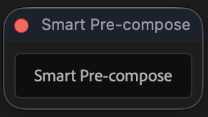
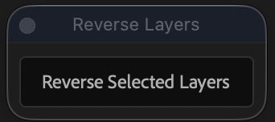
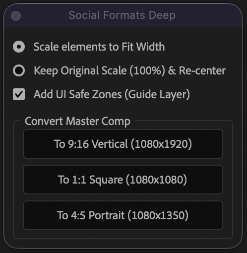
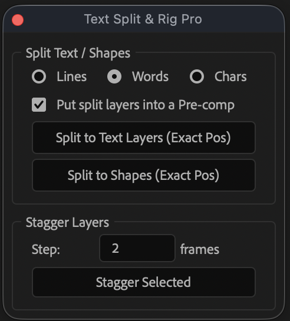
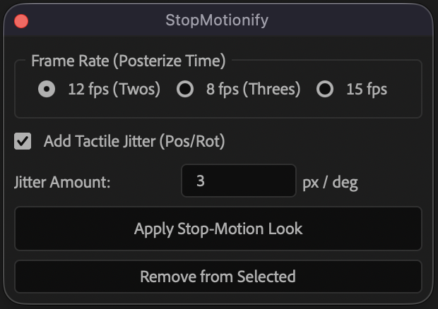

# After Effects ScriptUI Utilities

A collection of lightweight, dockable ScriptUI utility panels for Adobe After Effects to automate daily repetitive tasks.

---

### Included Tools

#### 1. Smart Pre-compose (`SmartPrecompose.jsx`)
Automatically calculates the exact visual bounding box of your selected layers, creates the pre-comp cropped precisely to that size, and positions it seamlessly in your main composition without shifting any elements.

#### 2. Reverse Layer Order (`ReverseLayerOrder.jsx`)
Instantly inverts the timeline stacking order of any selected layers with a single click. Ideal for fixing reversed vector import hierarchies and typography stacks.

#### 3. Social Formats Pro (`SocialFormatsPro.jsx`)
One-click multi-format generation from an active master comp. Instantly generates auto-centered and scaled compositions for:
* **9:16 Vertical** (1080x1920)
* **1:1 Square** (1080x1080)
* **4:5 Portrait** (1080x1350)
* **Batch All Formats**

#### 4. Text Stagger Splitter (`TextStaggerSplitter.jsx`)
Splits a text layer into per-line, per-word, or per-character layers (or shape layers via "Create Shapes from Text") while preserving exact original position, then staggers the in-points of any selected layers by a configurable frame step. Can optionally auto-precompose the split result.

#### 5. StopMotionify Framerate Controller (`StopMotionifyFramerateController.jsx`)
Applies a Posterize Time effect to selected layers to simulate stop-motion frame rates (12/8/15 fps), with an optional handcrafted "tactile jitter" wiggle expression on Position/Rotation. Includes a one-click removal of both the effect and the jitter expressions.

#### 6. Material Organizer (`MaterialOrganizer.jsx`)
One-click cleanup of the Project panel. **Create Folder Structure** sets up the empty type-based folders right after starting a new project, ready to drop material into. **Organize Materials** then sorts every item into those folders (Compositions, Video Footage, Images, Audio, Solids, Vector Files, Placeholders), with optional numbered prefixes for a fixed sort order, a dedicated folder for duplicate and unused footage, and flagging of missing/offline footage. Can reorganize items already buried in existing subfolders in one pass, while leaving a named folder (e.g. your "Final Comps" delivery folder) completely untouched. Also includes:
* **Color-labeling** items automatically by category.
* **Sequential renaming** of items within each folder for a tidy, ordered list.
* **Project Report** — item counts per category, total footage size on disk, and duplicate-file groups.
* **Font & Effects Audit** — lists every font and effect/plugin used across the project, flagging non-native ones, for a clean handoff.

#### 7. Easy Ease Keyframes (`EasyEaseKeyframes.jsx`)
Applies easing to every keyframe on every animated property of the selected layer(s) in one click — no need to select keyframes in the Graph Editor first. Five one-click presets cover the most common cases:
* **Default (33%)** — the standard Easy Ease (F9), balanced in and out.
* **Smooth (75%)** — slower, more cinematic ease in and out.
* **Ease In (Stop)** — strong deceleration into the keyframe (camera settle, coming to rest).
* **Ease Out (Launch)** — strong acceleration away from the keyframe (snappy start).
* **Linear (Remove Ease)** — resets keyframes to straight linear interpolation.

A **Custom** section is also available for a specific influence percentage and In+Out / In only / Out only mode, and a checkbox restricts any of the above to keyframes already selected per-property.

#### 8. Keyframe Markers (`KeyframeMarkers.jsx`)
Drops a comp marker at every frame that has a keyframe, named after the layer(s) and propert(y/ies) animated there (e.g. `Logo (Position, Scale) | Text (Opacity)`). Multiple keyframes landing on the same frame are combined into a single marker instead of stacking duplicates, and re-running the script won't duplicate text already present in a marker. Choose between the active composition only or every composition in the project (including pre-comps) in one pass, optionally restrict to selected layers or already-selected keyframes, and toggle whether property names are included in the marker text.

---

### Installation

1. Download the `.jsx` files from this repo.
2. Place the `.jsx` files in your After Effects **ScriptUI Panels** directory:
   * **Windows:** `C:\Program Files\Adobe\Adobe After Effects <version>\Support Files\Scripts\ScriptUI Panels\`
   * **macOS:** `/Applications/Adobe After Effects <version>/Scripts/ScriptUI Panels/`
3. Restart Adobe After Effects (or refresh scripts).
4. Launch them from the top menu under **Window > [Script Name].jsx** and dock them anywhere in your workspace.

---

### License & Support
Free to use in personal and commercial projects. If you find these useful and wish to support future updates, tips are appreciated via [Gumroad](https://8604769003016.gumroad.com/).
